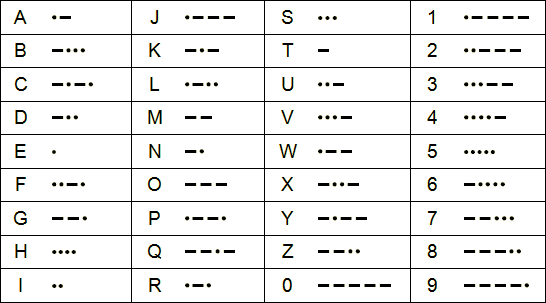

# morse-tr

Fast morse code translation module.

To install the package, type `npm i morse-tr` in a terminal and add this to your project:

```js
const morseTr = require('morse-tr');
```

## Morse Code formatting

* Parts of a letter aren't separated
* Letters of a word are separated by a single space
* Word are separated by a slash between spaces

`hello world` in morse: `.... . .-.. .-.. --- / .-- --- .-. .-.. -..`



## toMorse

Translates a string to morse code. If a letter is used in the string that isn't present in the notation a hash `#` will be inserted in its place.

```js
const hello = 'hello';
morseTr.toMorse(hello);        // '.... . .-.. .-.. ---'

const hash = 'aą bć';
morseTr.toMorse(hash);        // '.- # / -... #'

const invalid = '.- -.. <>?';
morseTr.toMorse(invalid);        // null
```

## toText

Translates a string of morse code to normal text. If a morse letter is used in the string that isn't present in the notation a hash `#` will be inserted in its place. If the string is not matched by notation's validation regex the function will return `null`as a failsafe.

```js
const hello = '.... . .-.. .-.. ---';
morseTr.toText(hello);        // 'hello'

const unkChars = '.- .-.-...- / -... --.-.-..-';
morse.toText(hash);        // 'a# b#'
```

## isValidMorse

Checks if a string is valid morse code.

```js
const a = '-.. . .-..';
const b = '-.. . <>?';

morseTr.isValidMorse(a);        // true
morseTr.isValidMorse(b);        // false
```

## notation

Notation properties:

```js
morseTr.notation
  .letters
  .numbers
  .symbols
  .allCharacters
  .validationRegex
  .unknownChar
```

Each character is an object with `text` and `morse` properties.

```js
morseTr.notation.letters[0];        // { text: 'a', morse: '.-' }
```

## Contribute

If you spot a bug, or want to improve this module, please contact me.
